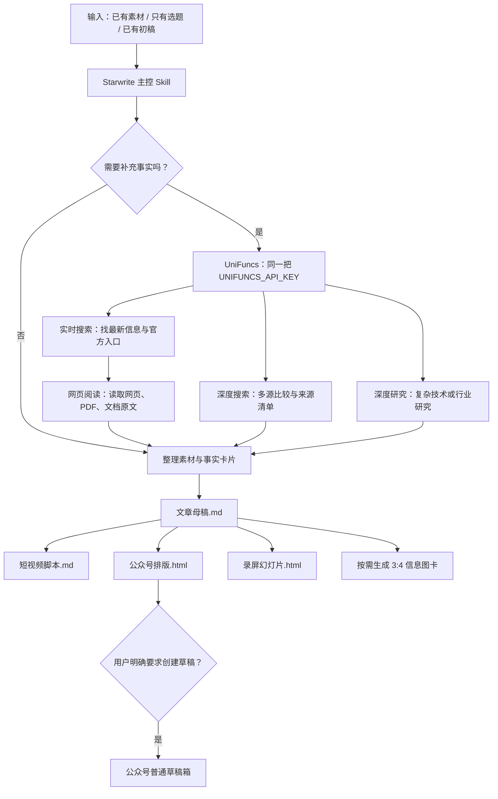

# Starwrite

Starwrite 是一个给 Codex/Agent 使用的中文内容生产主控 Skill。它把素材、选题或初稿组织成一个可追溯的文章项目，并从同一份 `文章母稿.md` 派生公众号 HTML、短视频脚本和录屏 HTML。

## 能做什么

- 将网页、笔记、RSS、文档整理为有来源的文章素材。
- 只有选题时，按需做实时搜索、网页阅读或深度研究，并输出事实卡片。
- 遇到视频、音频或播客时，按需转录为带时间戳的 Markdown。
- 写作、改稿与事实核验后生成唯一内容母稿 `文章母稿.md`。
- 生成蓝白高端扁平风的 3:4 信息图卡片、小红书封面、同风格公众号宽幅封面和正文配图，以及公众号排版 HTML、短视频脚本、适合浏览器录屏的 HTML Slides。
- 在用户明确授权且已完成配置时，把文章、封面和正文图片写入微信公众号**普通草稿箱**。

## 安装

安装到支持 Agent Skills 的环境：

```bash
# 安装 Starwrite 主控 Skill
npx skills add https://github.com/seeyouintokyo/starwrite/tree/main/skills/starwrite
```

随后直接告诉 Agent：`用 Starwrite 写一篇关于……的文章并生成公众号草稿。` Skill 会按需进入配置向导，而不是要求先手动读完 README。

## 工作流结构



### UniFuncs 运行前提

Starwrite 负责选择上述四种 UniFuncs 能力和管理同一把 Key，**不在本仓库内打包 UniFuncs HTTP 客户端或代理服务**。运行它的 Agent 必须具备下列任一条件：

1. 已连接 UniFuncs MCP：`https://mcp.unifuncs.com/mcp`，并使用 `Authorization: Bearer <UNIFUNCS_API_KEY>`；或
2. 能通过官方 REST API 发起 HTTPS 请求，并从私有配置读取 `UNIFUNCS_API_KEY`。

若两者都没有，Agent 应说明“缺少 UniFuncs 调用能力”，不能把搜索或研究说成已完成。

## 三种入口

| 入口 | 适用情况 | 起点 |
| --- | --- | --- |
| 已有素材 | 已有网页、笔记、RSS、文件或访谈 | 整理 `素材整理.md` 与 `事实卡片.md` |
| 只有选题 | 想从零写一篇可信的科普或分析 | 先研究与复核，再写作 |
| 已有初稿 | 已经写了文章但需要核验、排版、发布 | 先核验关键事实，再改稿 |

每篇文章都放入独立目录。面向用户的目录和文件统一使用中文命名；英文文件仅可作为上游工具的临时中间物，不作为最终交付：

```text
文章项目/
├── 任务说明.md
├── 素材整理.md
├── 事实卡片.md
├── 研究记录.md
├── 文章母稿.md
├── 短视频脚本.md
├── 公众号排版.html
├── 录屏幻灯片.html
├── 公众号缩略封面.png
├── 信息图卡-01.png
├── 信息图卡-02.png
├── 信息图卡-03.png
├── 发布结果.md
├── 交付清单.md
└── _资源/
```

`文章母稿.md` 是唯一母稿；公众号版和录屏版不会各自重新编造内容。

## 可选模块

Starwrite 是编排层，不把所有工具预装给每位用户。

| 模块 | 用途 | 何时调用 |
| --- | --- | --- |
| UniFuncs | 实时搜索、网页阅读、深度搜索、深度研究 | 选题缺少可靠素材时 |
| video-transcript | 视频、播客和本地音视频转录 | 输入含多媒体时；首次模型下载须征得同意 |
| human-writing | 中文成文与改稿 | 事实卡片完成后按需加载 |
| khazix-writer | 特定个人文风 | 仅用户明确指定时 |
| gzh-design-skill | Markdown 到公众号内联 HTML | `文章母稿.md` 定稿后 |
| html-ppt-skill | 文章到录屏 HTML Slides | `文章母稿.md` 定稿后 |
| post-to-wechat | 上传封面、正文图并创建普通草稿 | 用户明确要求发布时 |

封面和卡片优先使用 Agent 原生生图，默认按需生成。默认视觉为蓝白高端扁平商业科技风：3:4 系列卡片是小红书封面、小红书组图和公众号正文配图共用的主资产；公众号 API 草稿额外使用同风格 2.35:1 宽幅缩略封面，避免平台裁切。用户提供人像照片时才使用人像；指定模型、批量生产或原生生图失败时，才使用外部图像 API。中文文字会先检查，错误时改用可编辑文字层而非交付错字图。

## 使用步骤

1. 安装 Starwrite，然后告诉 Agent 你提供的是“已有素材”“只有选题”或“已有初稿”。
2. Agent 先创建一个文章项目文件夹：先完成研究和事实卡片，再写 `文章母稿.md`。
3. 你确认母稿后，再明确要求生成信息图卡、公众号排版、录屏或公众号草稿；没有要求的模块不运行。
4. 完成后打开该文章项目文件夹，先看 `交付清单.md`，再直接打开同级的文章、图片、排版 HTML 和录屏 HTML。

所有主要产物平铺在同一个文章项目文件夹，`_资源/` 只保留 HTML 运行依赖。没有使用的模块会在 `交付清单.md` 标明原因；Key、App Secret 与草稿 `media_id` 不会写入交付文件。

## UniFuncs 搜索模式

四种能力共用同一个 `UNIFUNCS_API_KEY`，无需为不同模式申请或配置不同 Key。默认由 Starwrite 按任务选择，用户也能直接说“用实时搜索”“用深度搜索”或“用深度研究”来覆盖默认选择：

| 模式 | 何时使用 |
| --- | --- |
| 实时搜索 + 网页阅读 | 产品科普、当前动态、寻找并读取官方来源 |
| 深度搜索 | 多源比较、需要更完整的来源清单 |
| 深度研究 | 技术或行业深度选题，需要研究推理、反例和较完整的研究报告 |

同一 Key 下各能力的价格、余额和权限可能不同；调用失败时先检查 UniFuncs 账户余额和该能力的访问权限。

## 首次配置向导

需要某项外部服务时，Skill 才会说明用途、官方获取位置与私有配置位置，并在得到授权后写入：

```text
~/.config/starwrite/.env
```

可选变量：

```dotenv
UNIFUNCS_API_KEY=...
WECHAT_APP_ID=...
WECHAT_APP_SECRET=...
```

Key 不进入文章项目、Git、Vercel 或 README。跳过某个配置只会跳过对应能力，例如没有公众号凭证仍可得到本地 HTML 和图片。

## 事实核验原则

先有 `事实卡片.md`，再写正文。每项关键事实要记录原始链接、发布日期或访问日期、来源类型与核验状态。搜索摘要只能找线索；产品功能、版本、价格与技术实现以官方网页、文档或代码仓库为准。没有可靠来源的说法不写入正文。

## 发布边界

公众号发布仅在用户明确要求后执行，默认动作是创建**普通草稿**。它不群发、不声明原创，也不替用户做最终发布决定。发布前必须上传并检查封面和正文图片，避免出现“只有封面、正文无图”。

## 上游依赖与协议

Starwrite 是 MIT 许可的**编排层**，不复制、打包或再发布下面任何上游 Skill 的源码、主题、模型或素材。使用时由用户在本机独立安装对应模块；其代码和产物分别受各上游项目许可证与平台条款约束。

| 上游项目 | 用途 | 协议 / 当前状态 | Starwrite 的处理 |
| --- | --- | --- | --- |
| [gzh-design-skill](https://github.com/isjiamu/gzh-design-skill) | 公众号排版 | AGPL-3.0 | 不复制源码或主题；用户单独安装。若修改或作为网络服务部署该项目，须按 AGPL-3.0 履行对应源码提供义务。 |
| [html-ppt-skill](https://github.com/lewislulu/html-ppt-skill) | 录屏 HTML | MIT | 用户单独安装并保留上游版权与许可声明。 |
| [video-transcript](https://github.com/Backtthefuture/video-transcript) | 视频/播客转录 | MIT | 用户单独安装并保留上游版权与许可声明。 |
| [human-writing](https://github.com/KKKKhazix/human-writing) | 中文写作与改稿 | MIT | 仅按需调用；用户单独安装并保留上游版权与许可声明。 |
| [baoyu-post-to-wechat](https://github.com/Aston1690/baoyu-post-to-wechat) | 公众号草稿箱适配 | 当前仓库未见顶层许可证 | Starwrite 不包含或再发布其代码；如要使用适配器，用户须自行核验其许可和使用授权。 |

`khazix-skills` 不是 Starwrite 的必需依赖；仅在用户明确选择特定个人文风时，才由用户自行安装并遵守其对应子 Skill 的许可证。UniFuncs、微信公众号 API 和生图服务属于外部服务，需遵守各自服务条款。

更详细的来源、协议边界与更新检查方式见 [上游依赖与许可说明](上游依赖与许可.md)。这不是法律意见；商用、修改或对外部署前应以各上游仓库当前许可证为准。
